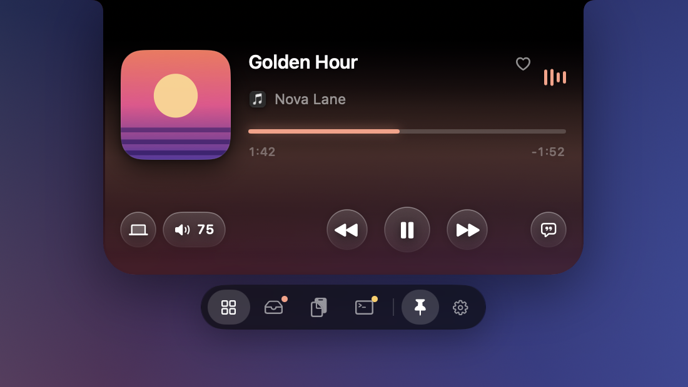
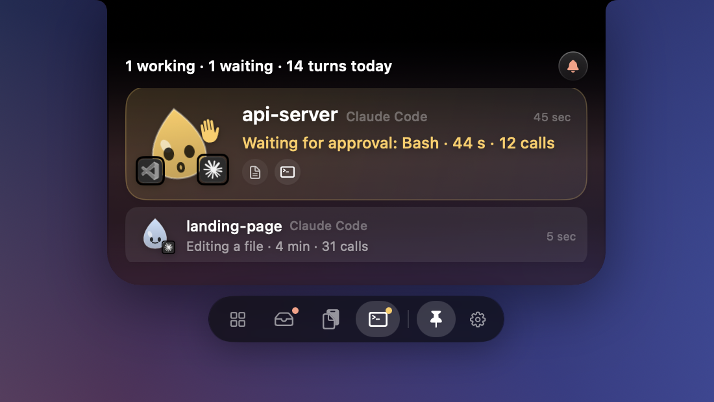
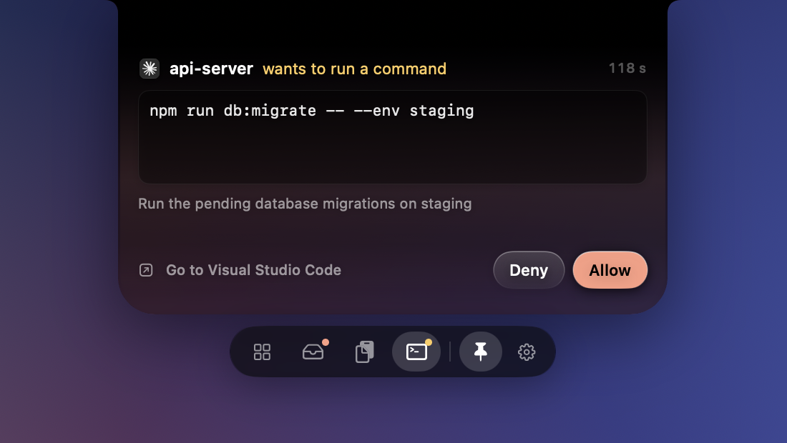
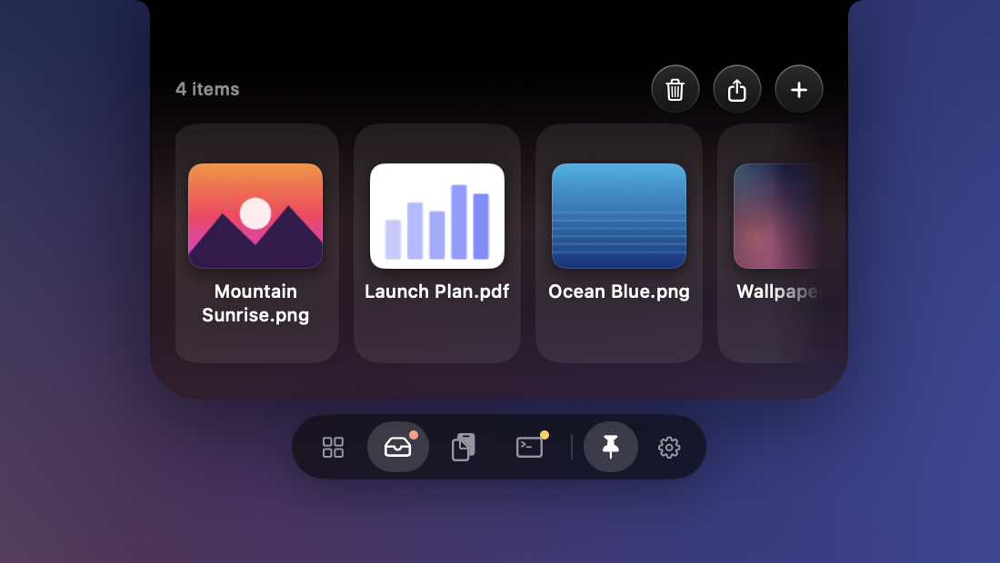

<p align="center">
  
</p>

<h1 align="center">Damla</h1>

<p align="center">
  <b>Your notch, finally doing something.</b><br>
  Music, sound, files, clipboard, focus and your AI coding agents, one glance away at the top of your screen.
</p>

<p align="center">
  <a href="https://github.com/erkamyigitaydin/Damla/releases/latest"></a>
  
  
</p>

---

The notch sits there all day doing nothing. Damla turns it into a small Liquid Glass hub: hover over it and a panel melts out of the notch with whatever you need right now, then slips back when you move away. No external monitor gets left out either. On displays without a notch, Damla draws one into the menu bar.

No account, no server, no tracking. Everything stays on your Mac.

## Install

```sh
brew install --cask erkamyigitaydin/tap/damla
```

Or grab the `.dmg` from the [latest release](https://github.com/erkamyigitaydin/Damla/releases/latest) and drag Damla to Applications. It's signed and notarized by Apple, so it opens without warnings, and it keeps itself up to date.

## What it does

### Now playing, from anything

<p align="center">
  
</p>

Apple Music, Spotify, Podcasts, YouTube in the browser: if it's playing, Damla shows it. Cover art, progress, play/pause, skip, and a heart for your Apple Music favorites. No setup, no log-ins.

- **Lyrics that scroll with the song.** Tap the lyrics button and the panel stretches down into an Apple Music-style lyrics view. Tap any line to jump there.
- **Smart handoff.** Start a video and your music pauses (or ducks). Stop the video and the music picks up where it left off.
- **Every player, side by side.** Several apps playing? Switch between them in one tap.
- **Colors from the cover.** The whole panel picks up the tint of the album you're listening to.

### Your AI agents, at a glance

<p align="center">
  
</p>

Running Claude Code or Codex in the background? Damla shows every session: which project is working, which one needs you, and how long it's been waiting. A little droplet mascot lives in the notch and reacts: it bounces while an agent works, waves when one needs you, and smiles when it's done. Click a session to jump straight to its terminal or editor.

### Approve commands without switching apps

<p align="center">
  
</p>

When Claude Code asks for permission, the question drops out of the notch with the exact command. Hit **Allow** or **Deny** and keep working. If you're already looking at the terminal, Damla stays out of the way.

### A shelf for your files

<p align="center">
  
</p>

Start dragging a file anywhere and the notch opens into a drop zone. Park files there, preview them with **Space** (Quick Look), drag them out into another app, or AirDrop them. Damla only remembers where your files are; it never moves or copies them.

### And more

- **Sound, your way.** Switch outputs, see your AirPods' battery when they connect, and set the volume of each app separately. Scroll on the notch to change the volume, swipe to skip tracks.
- **Beautiful volume and brightness indicators** that replace the system ones.
- **Clipboard history** with search and pinning (off until you turn it on).
- **Focus timer** for 25/45/50 minute sessions, with the countdown right in the notch.
- **Full-screen aware.** The notch hides with the menu bar in full-screen apps and comes back when you reach for it.
- **Cleaning mode** locks the keyboard for 60 seconds so you can wipe it without typing gibberish.
- **English and Turkish** interface.

## Getting started

- **Open:** hover over the notch, click the droplet in the menu bar, or press **⌃⌥Space**.
- **Close:** move the pointer away, click the notch, or press **Esc**.
- **Keep it open:** the pin button.
- **Settings:** the gear button, the menu bar icon or **⌘,**.

A short tour on first launch asks for the few permissions Damla can use. Every one of them is optional:

| Permission | What it unlocks |
|---|---|
| Automation (Music, Spotify) | Controlling Apple Music and Spotify in the background, and their volume |
| Accessibility | Damla's own volume/brightness indicators and Cleaning mode |
| System audio recording | Per-app volume in the mixer. Nothing is recorded or sent anywhere |

### Connecting your agents

Use the Agents step of the first-launch tour (menu bar → **Tour…**), or run the installer from this repository:

```sh
# Shows the plan first; --apply installs it. Add --approvals to answer Claude Code's prompts from the notch.
python3 scripts/install-agent-hooks.py --binary /Applications/Damla.app/Contents/MacOS/Damla --apply
```

The installer keeps your existing `~/.claude/settings.json` and `~/.codex/hooks.json` and leaves a backup of every file it changes. In Codex, approve the new hooks once with `/hooks`. The hooks only record status (phase, tool name, timing). Your prompts, conversations and command output are never read.

## Privacy

- No account, no server, no analytics.
- Your shelf, clipboard history and timer live in `~/Library/Application Support/Damla/`.
- Now-playing info is read locally from macOS.
- Only two things ever touch the network: lyrics, if you turn them on (title, artist, album and duration go to [lrclib.net](https://lrclib.net)), and the daily update check.

## Building from source

You need Swift 6 and the Xcode Command Line Tools.

```sh
zsh build.sh                                  # builds and signs ../Damla.app, then runs the self-test
../Damla.app/Contents/MacOS/Damla --self-test # automated checks
../Damla.app/Contents/MacOS/Damla --diagnose  # displays, battery, volume, brightness and audio outputs
```

<details>
<summary>More for developers</summary>

- **Code map:** `Layout.swift` is the single source of truth for shapes and window sizes. `PanelController.swift` runs one window per display. `MediaSessionStore` keeps the media logic free of AppKit so it can be tested.
- **Localization:** keys are the Turkish source strings; the English text lives in `Resources/en.lproj/Localizable.strings`.
- **Automation:** launched with `--debug`, the app listens for `app.local.damla.debug` distributed notifications (`open`, `tab-agents`, `media-showcase`, `files:<paths>`…). With `DAMLA_SUPPORT_DIR` set, a debug run keeps its data in that folder. The screenshots above were made this way with demo data.
- **Hook tests:** `PYTHONDONTWRITEBYTECODE=1 python3 scripts/test-agent-hooks.py`.
- **Releasing:**
  1. Bump `CFBundleShortVersionString` and `CFBundleVersion` in `Resources/Info.plist` and commit.
  2. Write the release notes to `dist/notes-<version>.md`.
  3. Run `zsh release.sh`. It builds a universal binary, signs it with Developer ID, notarizes it, signs the update for Sparkle, updates `appcast.xml`, publishes the GitHub Release and updates the Homebrew tap.

</details>

## Thanks

- [mediaremote-adapter](https://github.com/ungive/mediaremote-adapter) (BSD-3, bundled in `Vendor/MediaRemoteAdapter`): now-playing info on modern macOS.
- [Sparkle](https://sparkle-project.org): updates.
- [LRCLIB](https://lrclib.net): lyrics.
